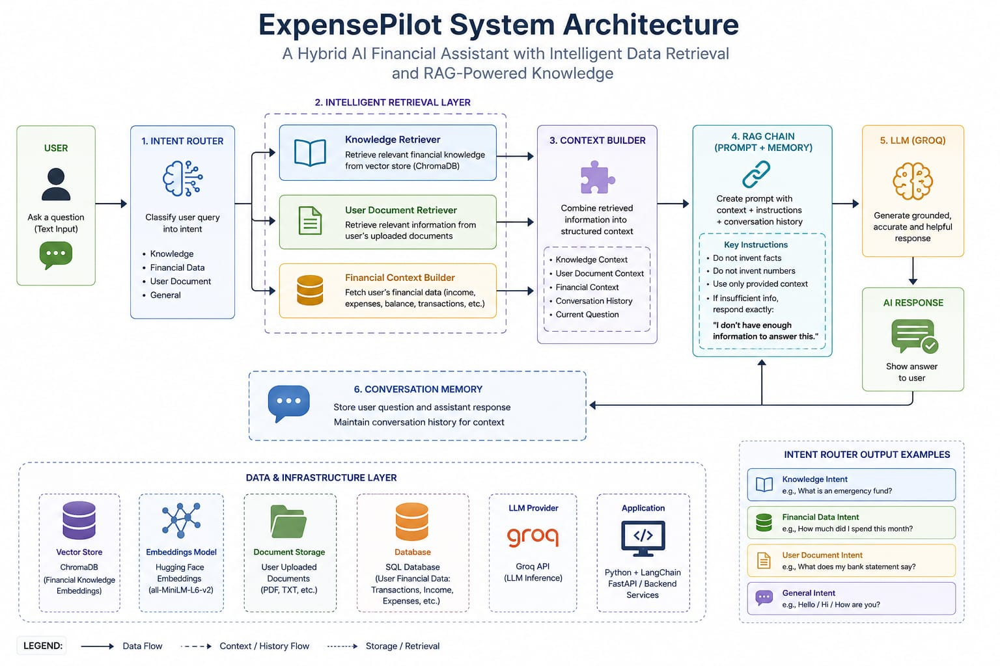

# ExpensePilot: A Hybrid AI Financial Assistant with Intelligent Data Retrieval and RAG-Powered Knowledge

<p align="center">
  <strong>An AI-powered personal finance management platform combining secure financial management, intelligent data retrieval, and Hybrid Retrieval-Augmented Generation.</strong>
</p>

<p align="center">
  
  
  
  
  
</p>

<p align="center">
  <a href="#-overview">Overview</a> •
  <a href="#-features">Features</a> •
  <a href="#-ai-powered-financial-assistant">AI Assistant</a> •
  <a href="#-hybrid-rag">Hybrid RAG</a> •
  <a href="#-architecture">Architecture</a> •
  <a href="#-installation">Installation</a>
</p>

---

## 📌 Overview

**ExpensePilot** is a full-stack personal finance management platform designed to help users manage, monitor, and understand their financial activities through a centralized application.

The project combines a modern financial management system with an **AI-powered financial assistant** built around **Hybrid Retrieval-Augmented Generation (RAG)**.

Unlike a traditional expense tracker, ExpensePilot combines financial management with an intelligent retrieval system capable of working with both **general financial knowledge** and **user-specific financial data**.

### Core capabilities include:

* Secure user authentication
* JWT-based authorization
* Google OAuth authentication
* User-specific financial data
* Transaction management
* Financial categories
* Budget management
* Financial goal tracking
* Financial reporting
* Financial dashboard
* Role-based authorization
* AI-powered financial assistance
* Intelligent data retrieval
* Hybrid RAG
* User-specific financial data retrieval
* Knowledge-document retrieval
* Context-aware AI responses

The AI component is maintained separately inside the `AI` directory and works alongside the core ASP.NET Core backend and React frontend.

---

# ✨ Features

## 🔐 Authentication & Authorization

ExpensePilot provides secure authentication and authorization for protecting user accounts and financial information.

### Features

* User registration
* User login
* JWT-based authentication
* Google OAuth authentication
* Password management
* Change password
* Role-based authorization
* Protected API endpoints
* User-specific financial data

---

## 📊 Financial Dashboard

The dashboard provides users with a centralized overview of their financial activity.

### Dashboard includes

* Total income
* Total expenses
* Current balance
* Monthly budget
* Budget progress
* Recent transactions
* Financial goals
* Spending overview
* Financial summaries

---

## 💳 Transaction Management

ExpensePilot provides complete CRUD functionality for managing financial transactions.

### Features

* Add transactions
* View transactions
* Update transactions
* Delete transactions
* Track income
* Track expenses
* Assign categories
* View transaction history
* User-specific transaction records

---

## 💰 Budget Management

Users can create and manage budgets to better control their spending.

### Features

* Monthly budget limits
* Category-based budgeting
* Budget tracking
* Budget progress monitoring
* Spending comparison
* User-specific budgets

Each user's financial budget information is isolated from other users.

---

## 🏷️ Category Management

Transactions can be organized using financial categories.

The system supports:

* Income categories
* Expense categories
* Default categories
* User-created categories

---

## 🎯 Financial Goals

Users can create and monitor long-term financial goals.

### Goal information includes

* Goal name
* Target amount
* Current progress
* Target date
* Goal status
* Progress tracking

---

## 📈 Financial Reports

ExpensePilot provides financial reporting functionality to help users understand their financial activity.

Reports can be generated using transaction and budgeting information to provide meaningful financial summaries.

---

# 🤖 AI-Powered Financial Assistant

One of the major components of ExpensePilot is its **AI-powered financial assistant**.

The assistant uses a **Hybrid RAG architecture** to retrieve relevant information before generating an answer.

What makes the system different from a basic document-based RAG implementation is that it can work with **multiple sources of information**.

The AI assistant can retrieve:

1. **General knowledge from indexed documents**
2. **User-specific financial information from the application's data**
3. **Both sources together when the query requires them**

This allows the assistant to answer both general financial questions and questions related specifically to the user's own financial situation.

---

# 🧠 Hybrid RAG

ExpensePilot implements a **Hybrid Retrieval-Augmented Generation architecture** that combines intelligent retrieval from multiple sources.

The retrieval system can work with:

### 📚 Knowledge Documents

The system can retrieve relevant information from the available financial knowledge/document collection.

This allows the assistant to answer general questions about topics such as:

* Personal finance
* Budgeting
* Saving
* Financial planning
* Expense management
* Other indexed financial knowledge

### 👤 User Financial Data

The AI assistant can also retrieve relevant information from the authenticated user's financial data.

Depending on the question, this can include information such as:

* Transactions
* Income
* Expenses
* Categories
* Budgets
* Financial goals
* Other relevant user-specific financial information

The system is designed around the principle that **user financial data should remain user-specific**.

### 🔀 Combined Retrieval

Some questions may require both general knowledge and the user's personal financial information.

In such cases, the system can combine the relevant information from both sources before sending the context to the language model.

---

# 💡 Intelligent Source Selection

The AI assistant determines what type of information is relevant to the user's query.

For example:

### General Knowledge Query

```text
How can I reduce unnecessary monthly expenses?
```

The system can retrieve relevant information from the financial knowledge documents.

```text
User Query
    ↓
Knowledge Retrieval
    ↓
Relevant Financial Knowledge
    ↓
LLM
    ↓
Response
```

---

### User-Specific Query

```text
How much did I spend on food this month?
```

This question requires the user's financial information.

```text
User Query
    ↓
User Data Retrieval
    ↓
Relevant Transactions
    ↓
LLM
    ↓
Response
```

---

### Combined Query

```text
I spent more on food this month. How can I reduce it?
```

This type of question can require both:

* The user's actual spending information
* General financial knowledge about reducing food expenses

The system can therefore combine both sources:

```text
                    User Query
                        │
             ┌──────────┴──────────┐
             │                     │
             ▼                     ▼
      User Data Retrieval    Knowledge Retrieval
             │                     │
             │                     │
             └──────────┬──────────┘
                        ▼
                 Combined Context
                        │
                        ▼
                       LLM
                        │
                        ▼
                 Context-Aware Answer
```

This allows the AI assistant to provide responses that are both **personalized and knowledge-grounded**.

---

# 🔄 Hybrid RAG Retrieval Pipeline

```text
                         ┌──────────────┐
                         │     User     │
                         └──────┬───────┘
                                │
                                ▼
                       ┌─────────────────┐
                       │   User Query    │
                       └────────┬────────┘
                                │
                                ▼
                       ┌─────────────────┐
                       │ Query Processing│
                       └────────┬────────┘
                                │
              ┌─────────────────┼─────────────────┐
              │                 │                 │
              ▼                 ▼                 ▼
       User Data         Semantic Search     Keyword Search
       Retrieval         on Knowledge        on Knowledge
              │                 │                 │
              │                 └────────┬────────┘
              │                          │
              │                   Hybrid Retrieval
              │                          │
              └──────────────┬───────────┘
                             ▼
                    Relevant Context
                             │
                             ▼
                    Context Assembly
                             │
                             ▼
                           LLM
                             │
                             ▼
                     AI Response
```

---

# 🎯 Why Hybrid RAG?

A single retrieval strategy does not always provide the best results.

ExpensePilot combines:

* User-specific data retrieval
* Semantic retrieval
* Keyword retrieval
* Knowledge-document retrieval
* Context-aware generation

Semantic retrieval is effective at understanding **meaning and context**, while keyword retrieval is useful for identifying **specific and exact terms**.

User-data retrieval allows the system to personalize responses based on the authenticated user's financial information.

Combining these approaches enables the assistant to answer different types of questions using the appropriate information sources.

### Benefits

* Personalized financial responses
* Improved retrieval relevance
* Better context selection
* Greater information coverage
* Support for general financial questions
* Support for user-specific financial questions
* Support for combined questions
* Better handling of different query formulations
* More grounded AI responses
* Reduced dependence on the LLM's internal knowledge

---

# 🧩 AI Architecture

The AI component follows a retrieval-first architecture:

```text
User
 │
 ▼
AI Financial Assistant
 │
 ▼
Query Processing
 │
 ├───────────────────────┐
 │                       │
 ▼                       ▼
User Financial Data   Knowledge Retrieval
Retrieval                  │
 │                    ┌────┴─────┐
 │                    │          │
 │                    ▼          ▼
 │                 Semantic   Keyword
 │                 Search     Search
 │                    │          │
 │                    └────┬─────┘
 │                         │
 └──────────────┬──────────┘
                ▼
        Context Assembly
                │
                ▼
               LLM
                │
                ▼
          AI Response
```

The AI implementation is maintained independently inside the project's `AI` directory.

---

# 🏗️ System Architecture

ExpensePilot follows a multi-component architecture consisting of:

1. React frontend
2. ASP.NET Core backend
3. PostgreSQL database
4. AI / Hybrid RAG component
5. Knowledge retrieval system

```text
                           ┌──────────────────┐
                           │       User       │
                           └────────┬─────────┘
                                    │
                                    ▼
                           ┌──────────────────┐
                           │ React Frontend   │
                           └────────┬─────────┘
                                    │
                              REST API / HTTP
                                    │
                                    ▼
                           ┌──────────────────┐
                           │ ASP.NET Core API │
                           └───────┬───┬──────┘
                                   │   │
                         ┌─────────┘   └──────────────┐
                         ▼                            ▼
                ┌─────────────────┐          ┌─────────────────┐
                │   PostgreSQL    │          │   AI Service    │
                │    Database     │          │   Hybrid RAG    │
                └─────────────────┘          └────────┬────────┘
                                                       │
                                     ┌─────────────────┼─────────────────┐
                                     │                 │                 │
                                     ▼                 ▼                 ▼
                              User Data         Semantic Search    Keyword Search
                              Retrieval          Knowledge Base    Knowledge Base
                                     │                 │                 │
                                     └─────────────────┼─────────────────┘
                                                       ▼
                                              Context Assembly
                                                       │
                                                       ▼
                                                     LLM
                                                       │
                                                       ▼
                                                AI Response
```

---

# 🖼️ Architecture Diagram

The complete ExpensePilot architecture diagram is stored inside the `Images` directory.

```text
ExpensePilot---Financial-Planner/
│
├── Images/
│   └── ExpensePilot-Architecture.jpg
│
└── README.md
```

<p align="center">
  
</p>

---

# 🛠️ Technology Stack

## Frontend

<p align="center">
  
  
  
  
</p>

* React.js
* Vite
* JavaScript
* React Router
* Axios
* HTML5
* CSS3

---

## Backend

<p align="center">
  
  
  
  
</p>

* C#
* ASP.NET Core Web API
* .NET 8
* Entity Framework Core
* ASP.NET Core Identity
* JWT Authentication
* Google OAuth
* Swagger / OpenAPI

---

## Database

<p align="center">
  
</p>

* PostgreSQL
* Entity Framework Core
* EF Core Migrations

---

## AI & RAG

<p align="center">
  
  
  
</p>

* Python
* Retrieval-Augmented Generation
* Hybrid Retrieval
* Semantic Search
* Keyword Retrieval
* Vector Embeddings
* Large Language Models
* User-data retrieval
* Knowledge-document retrieval
* Context-aware generation

---

# 📁 Project Structure

```text
ExpensePilot---Financial-Planner/
│
├── backend/
│   │
│   └── ExpensePilot.API/
│       ├── Controllers/
│       ├── Data/
│       ├── DTOs/
│       ├── Models/
│       ├── Services/
│       ├── Migrations/
│       ├── Middleware/
│       ├── Properties/
│       └── Program.cs
│
├── frontend/
│   │
│   └── expensepilot/
│       ├── public/
│       ├── src/
│       │   ├── components/
│       │   ├── pages/
│       │   ├── services/
│       │   ├── assets/
│       │   └── ...
│       ├── package.json
│       └── vite.config.js
│
├── AI/
│   ├── ...
│   └── ...
│
├── Images/
│   └── ExpensePilot-Architecture.jpg
│
├── README.md
└── .gitignore
```

> The `AI` directory contains the AI-powered Hybrid RAG implementation, while the `backend` directory contains the core ASP.NET Core API and financial management logic.

---

# 🔌 Backend Architecture

The backend is built using **ASP.NET Core Web API** and provides the core business logic and REST APIs for the application.

### Backend responsibilities

* Authentication
* Authorization
* User management
* Transaction management
* Category management
* Budget management
* Financial goals
* Reports
* Dashboard data
* Database operations

### Request Flow

```text
HTTP Request
     │
     ▼
Controller
     │
     ▼
DTO / Validation
     │
     ▼
Business Logic / Service
     │
     ▼
Entity Framework Core
     │
     ▼
PostgreSQL
     │
     ▼
HTTP Response
```

---

# 🔑 Authentication Flow

## JWT Authentication

```text
User
 │
 ▼
Register / Login
 │
 ▼
ASP.NET Core Identity
 │
 ▼
JWT Token
 │
 ▼
React Frontend
 │
 ▼
Authenticated API Requests
```

Protected API endpoints require a valid authentication token.

---

# 🔵 Google OAuth

ExpensePilot also supports Google authentication.

```text
User
 │
 ▼
Google Login
 │
 ▼
Google OAuth
 │
 ▼
Backend Verification
 │
 ▼
Authenticated User
 │
 ▼
JWT Token
 │
 ▼
ExpensePilot
```

---

# 🗄️ Database Architecture

The PostgreSQL database stores application and financial data.

Major data areas include:

```text
User
 │
 ├── Transactions
 │
 ├── Categories
 │
 ├── Budgets
 │
 ├── Financial Goals
 │
 └── Financial Records
```

Entity Framework Core migrations are used to manage database schema changes.

The AI component can retrieve relevant financial information associated with the authenticated user when required by the query.

---

# 🔒 Security

ExpensePilot handles sensitive financial information, making security an important part of the system.

The application uses:

* JWT authentication
* ASP.NET Core Identity
* Role-based authorization
* Protected API endpoints
* User-specific data access
* Secure password management
* Google OAuth
* Environment-based secret management
* Database-level user relationships

The AI retrieval layer is designed to work with the authenticated user's relevant financial information rather than exposing unrelated users' data.

---

# 🔄 Overall Application Flow

```text
                         ┌──────────────┐
                         │     User     │
                         └──────┬───────┘
                                │
                                ▼
                       ┌─────────────────┐
                       │ React Frontend  │
                       └───────┬─────────┘
                               │
                    ┌──────────┴──────────┐
                    │                     │
                    ▼                     ▼
             REST API Requests       AI Requests
                    │                     │
                    ▼                     ▼
          ┌─────────────────┐    ┌─────────────────┐
          │ ASP.NET Core    │    │ AI / Hybrid RAG │
          │ Backend         │    │     Service     │
          └────────┬────────┘    └────────┬────────┘
                   │                      │
                   ▼                      ▼
          ┌─────────────────┐     ┌──────────────────┐
          │   PostgreSQL    │     │ Retrieval Layer  │
          └─────────────────┘     └────────┬─────────┘
                                           │
                              ┌────────────┴────────────┐
                              │                         │
                              ▼                         ▼
                       User Financial Data      Knowledge Documents
                              │                         │
                              └────────────┬────────────┘
                                           ▼
                                    Context Assembly
                                           │
                                           ▼
                                          LLM
                                           │
                                           ▼
                                      AI Response
```

---

# 📦 Core Application Modules

```text
ExpensePilot
│
├── 🔐 Authentication
│   ├── Registration
│   ├── Login
│   ├── JWT Authentication
│   ├── Google OAuth
│   └── Password Management
│
├── 📊 Dashboard
│   ├── Income Overview
│   ├── Expense Overview
│   ├── Balance
│   ├── Budget Progress
│   └── Financial Summary
│
├── 💳 Transactions
│   ├── Create
│   ├── Read
│   ├── Update
│   └── Delete
│
├── 🏷️ Categories
│   ├── Default Categories
│   └── User Categories
│
├── 💰 Budgets
│   ├── Monthly Budget
│   └── Category Budgets
│
├── 🎯 Financial Goals
│   └── Goal Tracking
│
├── 📈 Reports
│   └── Financial Reporting
│
└── 🤖 AI Financial Assistant
    │
    ├── User Data Retrieval
    │
    ├── Knowledge Retrieval
    │   ├── Semantic Retrieval
    │   └── Keyword Retrieval
    │
    ├── Hybrid Context
    │
    └── LLM Generation
```

---

# 🚀 Installation

## Prerequisites

Make sure the following are installed:

* .NET 8 SDK
* Node.js
* npm
* PostgreSQL
* Python
* Git

---

## 1. Clone Repository

```bash
git clone https://github.com/AmnaMastoor/ExpensePilot---Financial-Planner.git

cd ExpensePilot---Financial-Planner
```

---

## 2. Backend Setup

Navigate to the backend:

```bash
cd backend
```

Restore .NET dependencies:

```bash
dotnet restore
```

Configure your database connection and authentication settings.

Apply Entity Framework migrations:

```bash
dotnet ef database update
```

Run the API:

```bash
dotnet run
```

Swagger/OpenAPI can be used to explore and test the API during development.

---

## 3. Frontend Setup

Open another terminal:

```bash
cd frontend
```

Install dependencies:

```bash
npm install
```

Start the Vite development server:

```bash
npm run dev
```

Open the URL provided by Vite.

---

## 4. AI Setup

Navigate to the AI directory:

```bash
cd AI
```

Create a Python virtual environment:

```bash
python -m venv .venv
```

### Windows

```bash
.venv\Scripts\activate
```

### Linux / macOS

```bash
source .venv/bin/activate
```

Install the required dependencies:

```bash
pip install -r requirements.txt
```

Configure the required AI/LLM environment variables before running the AI component.

---

# 🔐 Environment Configuration

Sensitive credentials should **never be committed to GitHub**.

Depending on the configured environment, the application may require:

```text
Database connection string
JWT configuration
Google OAuth credentials
AI / LLM API credentials
AI service configuration
Frontend API URL
```

Use environment variables or appropriate local configuration files for sensitive information.

---

# 🧪 API Documentation

ExpensePilot exposes RESTful APIs for the major application modules.

Swagger/OpenAPI is included for development and API testing.

Major API areas include:

```text
Authentication
Users
Transactions
Categories
Budgets
Financial Goals
Reports
Dashboard
```

---

# 🧠 AI Design Philosophy

ExpensePilot follows a **retrieval-first AI architecture**.

Instead of asking the language model to answer a financial question using only its internal knowledge, the system first determines what information is relevant and retrieves it.

The retrieved information may come from:

* User-specific financial data
* Financial knowledge documents
* Both sources when required

The resulting context is then provided to the language model.

```text
User Question
      │
      ▼
Determine Relevant Sources
      │
      ├───────────────┐
      ▼               ▼
User Data        Knowledge Base
Retrieval        Retrieval
      │               │
      └───────┬───────┘
              ▼
       Combined Context
              │
              ▼
             LLM
              │
              ▼
       Generated Response
```

---

# 🎯 Project Objectives

ExpensePilot was developed to:

* Simplify personal financial management
* Provide secure financial data management
* Help users track income and expenses
* Improve budgeting
* Track financial goals
* Generate useful financial reports
* Provide personalized AI-powered financial assistance
* Retrieve relevant user-specific financial information
* Retrieve relevant financial knowledge
* Combine multiple information sources when required
* Demonstrate Hybrid RAG in a real-world application
* Combine full-stack development with modern AI techniques

---

# 🔮 Future Improvements

Potential future enhancements include:

* Advanced financial analytics
* AI-powered spending recommendations
* Automated transaction categorization
* Spending trend prediction
* Financial forecasting
* Recurring transactions
* Budget alerts
* Email notifications
* AI-generated financial reports
* Advanced RAG evaluation
* Retrieval ranking optimization
* Improved personalized financial insights
* Mobile application
* Enhanced admin analytics

---

# 👥 Contributors

ExpensePilot was collaboratively developed by:

* **Amna Mastoor**
* **Nouman Saeed Butt**

Both contributors worked on the development and implementation of the platform, including its full-stack financial management functionality and AI-powered Hybrid RAG component.

---

# 📜 License

This project was developed for educational and software development purposes.

---

<p align="center">
  <strong>ExpensePilot</strong>
  <br><br>
  <em>Smarter Financial Management Through Full-Stack Development and AI</em>
</p>
